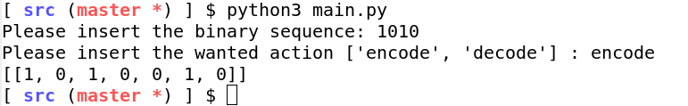
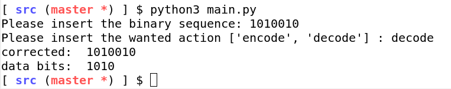

# Rapport TP: Code de Hamming

- UFR ST de l'université du Havre.

---

@Author: Massiles GHERNAOUT.

---


### Sujet

Le but du projet est de pouvoir développer un programme en Java|Python qui
acceptera une trame binaire et une action (encode|décode). Suivant l'action
choisie, le trame binaire peut alors être encoder selon la méthodologie des
codes de Hamming avant un envois, où bien au contraire, décoder pour
potentiellement corriger et puis extraire les données reçu.


*Note:*

Pour ce qui est du décodage, le programme fonctionne pour n'importe quelle
taille de mots, et ceci sans étape intermédiaire.

Toutefois, pour ce qui est du encodage, le programme va d'abord décomposer le
mot binaire en sous-mots de 4 bits, pour ensuite encoder avec la configuration
7-4 des codes de Hamming. Ceci a pour objectif de simplifier le calcul et
potentiellement avoir un système de cache.

Aussi, cela pourra rendre ce protocole de détection d'erreur plus fiable, étant
donnée que la probabilité de d'avoir deux erreurs sur 4 bits est bien plus
moindre que si notre mots fait une taille supérieure. Toutefois, cela ne
marche plus dans le cas où les erreurs surgissent en BURST (une vague d'erreur
à un temps donnée).


### Rappel bref du encodage/décodage d'une trame binaire suivant les code de Hamming

*À l’envoie:*

- On calcule la taille du mots à envoyer.
- On trouve la combinaison des code de Hamming correspondante.
- Si la longueurs n'est pas canonique, on étend le mot binaire avec des 0 au début.
- Une fois que la combinaison est définie, on calcule le nombre de bits de
  détection d'erreurs à avoir.
- On calcule leurs positions.
- On calcule leurs valeurs, tel que chaque bit de détection d'erreur Ci devra être égale
  à la somme de certains bits a,b,c...z  du mot binaire, et que somme(Ci + a,b,c...z)==0
  (C'est ce que Ci' vérifiera à la réception)
- On positionne proprement les bits de détection d'erreurs et les bits de
  donnée, et on envois le mot. 

*À la réception:*

- On calcule la taille du mot reçu.
- On trouve la combinaison des code de Hamming correspondante. La combinaison
  doit être déduite sans aucun changement au mot.
- On calcule le nombre de bits de détection d'erreur. 
- On calcule leurs position.
- On les extrait, et on les juxtapose.
- On vérifie que, une fois juxtaposés, leurs valeurs est égale à 0 en décimal.
- Dans le cas contraire, la valeur indique la position de l'erreur.
- On corrige le bit erroné. (xor 1 pour basculer le bit).
- On extrait les bits de détection.
- On affiche le message reçu (état brute - sans code de Hamming).


### Implémentation 

Pour l’implémentation on a décider d'utiliser Python. Car il est plus simple à
utiliser et a une meilleure API pour les listes et les chaînes de caractères.

##### Architecture du projet 

```sh

    .
    ├── doc
    │   ├── CompteRenduTP3.md
    │   ├── notes.txt
    │   └── RESEAUX-TP-Hamming.pdf
    └── src
        ├── config.py
        ├── main.py
        └── utils
            ├── constants.py
            ├── decode.py
            ├── encode.py
            └── helpers.py 


```

*`./src`*

Dans la partie `./src` on retrouve un sous dossier `./src/utils` qui contient
un fichier `./src/utils/encode.py`, dedans on retrouvera la fonction qui encode
un mot binaire de taille quelconque suivant les codes de Hamming. (côté
émetteur)


Dans le fichier `./src/utils/decode.py`, on retrouvera la fonction qui décodera
un mot binaire de taille quelconque reçu. (côté récepteur)


*`./doc`*

Dans la partie `./doc`, on retrouvera le sujet du TP  ainsi que ce rapport.


### Utilisation

Pour exécuter le programme, veuillez suivre les instruction suivantes:

```bash

    # go to the src folder
    cd ./project/src

    # exec with python 
    python3 main.py

```

Le programme vous demandera d'insérer votre trame binaire puis l'action désirée.

```bash

    $ python3 main.py 
    Please insert the binary sequence: 1010010
    Please insert the wanted action ['encode', 'decode'] : decode
    corrected:  1010010
    data bits:  1010

```


### Résultat des tests

Les tests effectués sont basés sur les exemples du cours/TD.


**Exemples de tests:**


*Encoding Test*


<br>


*Decoding Test*



### Conclusion

Durant ce projet j'ai pu approfondir ma compréhension des code de Hamming, et
aussi mes connaissance en Python. Par ailleurs, voilà quelques todo pour la
suite: 

* Simplifier le code, car durant ce projet, j'ai expérimenté/exploré Python,
  et cela a aboutit à un code pas très agréable à lire. (plein de constantes et
  d'imports, et des nom de variables beaucoup trop long.) 


